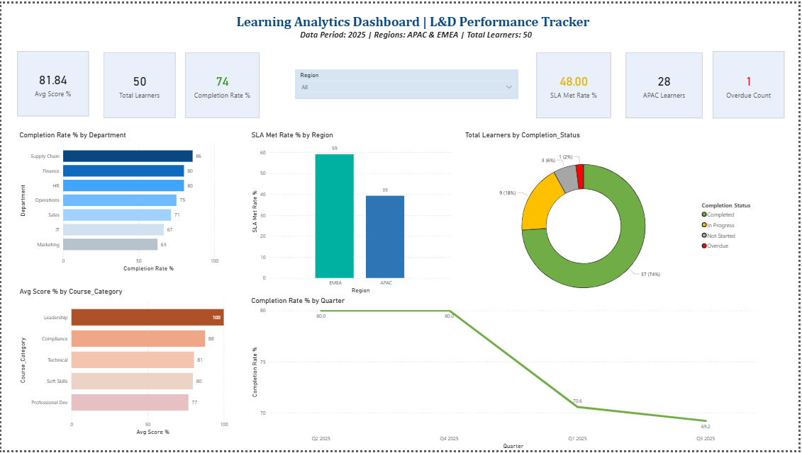

# 📊 Learning Analytics Dashboard — L&D Performance Tracker

## Overview
An interactive single-page Power BI dashboard built to track 
training completion, SLA compliance, and learner performance 
across APAC & EMEA regions for 50 learners across 7 departments.

## Dashboard Preview

## Key Insights
- 📉 SLA Compliance at 48% — flagged as critical risk
- 📊 74% overall completion rate across all departments
- 🌍 EMEA outperforms APAC on SLA compliance (58 vs 39)
- 📉 Completion declining from 80% (Q2) to 69.2% (Q3 2025)
- 🏆 Supply Chain leads (86%), Marketing lags (63%)

## Tools Used
- Microsoft Power BI Desktop
- Microsoft Excel (Data preparation)
- DAX Measures (KPI calculations)
- Notion (Documentation & PM Insight Report)

## Files
- `Learning_Analytics_Dataset.xlsx` — Raw dataset (50 learners)
- `LA_Dashboard.pbix` — Power BI dashboard file
- `dashboard_preview.png` — Dashboard screenshot

## Skills Demonstrated
- Learning Analytics & Data Visualisation
- Power BI Dashboard Design
- DAX Formula Writing
- L&D Project Management
- Stakeholder Reporting

## About
Built by **Kamlesh Baneshi (Kabir)** — Senior Learning Analyst 
at Vantive | Aspiring L&D Project Manager
📧 kamlesh.baneshi052002@gmail.com
🔗 [LinkedIn Profile](your-linkedin-url)
